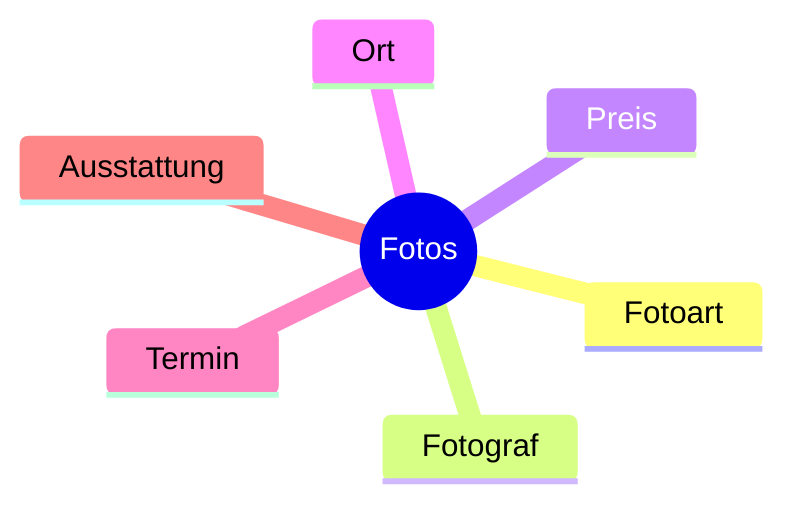

# Projektmanagement

## Mindmap

Mindmaps dienen zur **visuellen Darstellung** eines Themas. Die einzelnen *Knoten* können unter anderem auch dazugehörige *Unterknoten* aufweisen.

Mit *Kommentaren* oder *Symbolen* können zusätzliche Informationen aufgezeichnet werden.

Durch die Erstellung einer **Mindmap** wird das Thema auch **sehr strukturiert** darstellbar.

